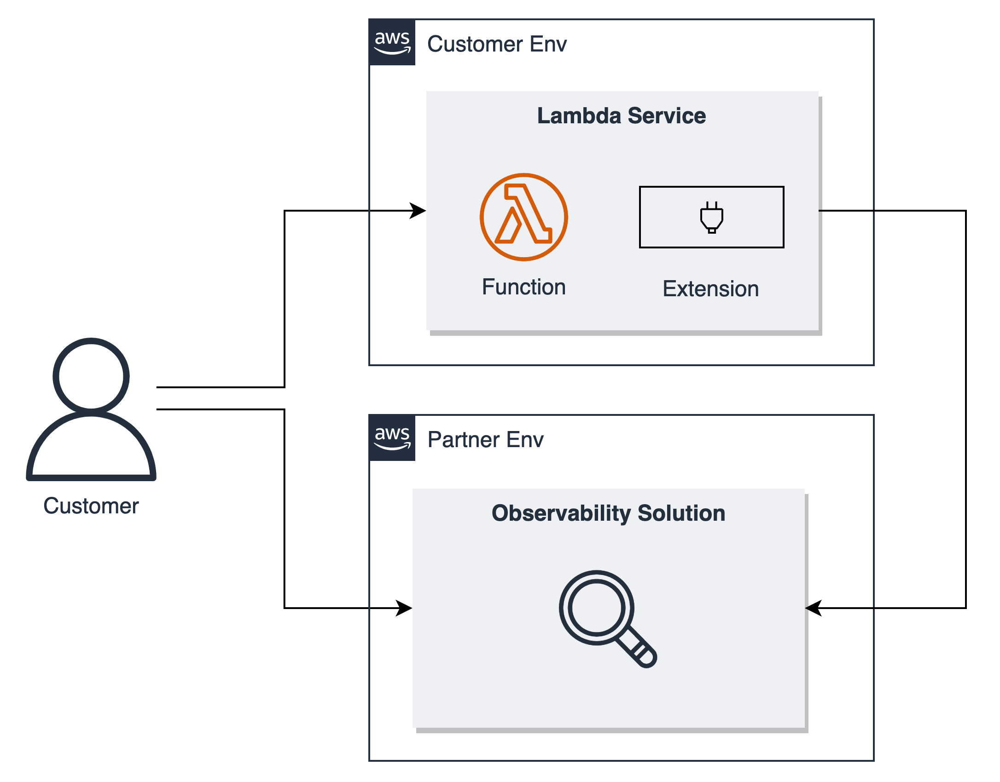
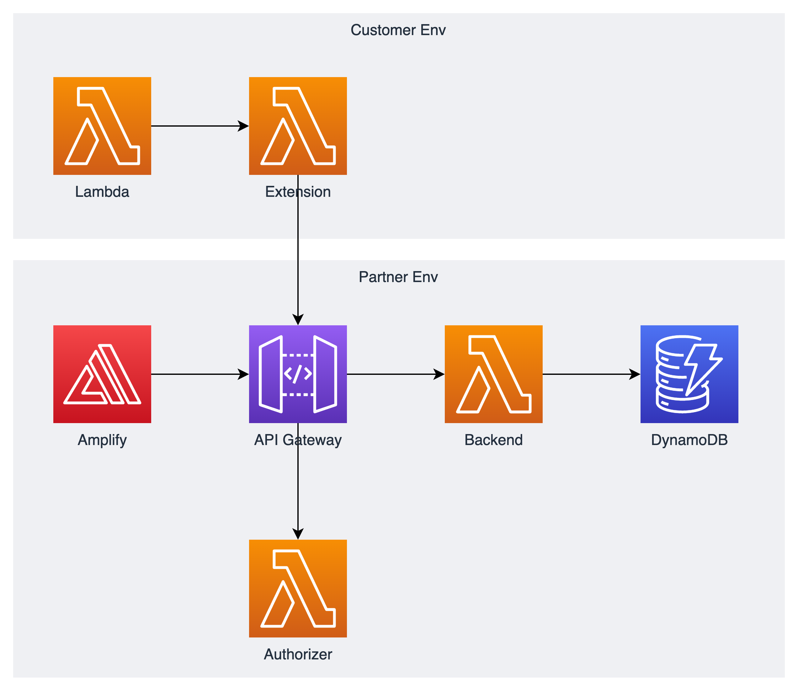

## AWS Lambda Extensions Workshop

This project contains the code for the AWS Lambda Extensions Workshop.
You can find the content and instructions for the workshop [here]().

You will learn what Lambda Extensions are, how to use existing AWS Native and third-party extensions, and create your own extension.

# Architecture & Lab Overview

## [Test out Lambda Insights]()

In this module you will learn how to use AWS console to implement one of the out-of-the-box extension, Lambda Insights. You will see how the function execution changes as a result of implementing an extension. You will also learn about other available out-of-the-box extensions.

## [Building an Observability Extension with the Telemetry API]()

In this module you will learn how to build your own extension, for observability on your Lambda function. You will learn how to use the provided Telemetry API to ship telemetry data (logs, metrics) to a sample SaaS endpoint and be able to view it on their solution.

## [Publishing and Distributing extensions]()

In this module you will learn how to publish and distribute extensions to other AWS accounts.

## Security

See [CONTRIBUTING](CONTRIBUTING.md#security-issue-notifications) for more information.

## License

This library is licensed under the MIT-0 License. See the LICENSE file.